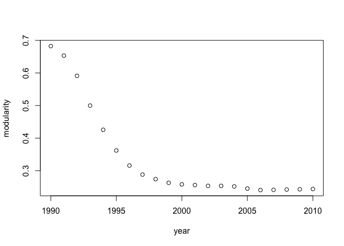
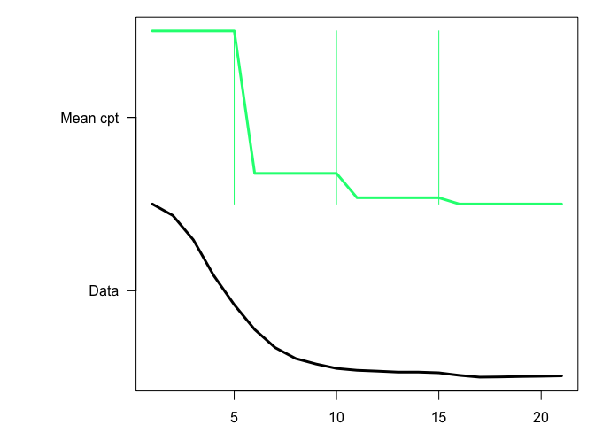

### load data

    # set working dictionary for the example folder
    source('../code/functions.R') 
    # Input: A sequence of networks represented in the form of adjacency matrices.
    load("adj_mat_seq.RData")

### Find common community structure across the whole time period

    yr = seq(1990,2010)
    res = mod_cluster(Adj = adj, yr, start=1)

    ## 
    ## Attaching package: 'igraph'

    ## The following objects are masked from 'package:stats':
    ## 
    ##     decompose, spectrum

    ## The following object is masked from 'package:base':
    ## 
    ##     union

    ## Script created: /var/folders/c4/0gzdytxd4wb8cl0yfty93rlr0000gn/T//RtmpxvhINq/file23c25fdd8ce0.m

    ## Command run is:

    ## '/Applications/MATLAB_R2021b.app/bin'/matlab  -nodesktop -nosplash -nodisplay -r  "try, run('/var/folders/c4/0gzdytxd4wb8cl0yfty93rlr0000gn/T//RtmpxvhINq/file23c25fdd8ce0.m'); catch err, disp(err.message); exit(1); end; exit(0);"

    ## Script created: /var/folders/c4/0gzdytxd4wb8cl0yfty93rlr0000gn/T//RtmpxvhINq/file23c24a4bf74b.m

    ## Command run is:

    ## '/Applications/MATLAB_R2021b.app/bin'/matlab  -nodesktop -nosplash -nodisplay -r  "try, run('/var/folders/c4/0gzdytxd4wb8cl0yfty93rlr0000gn/T//RtmpxvhINq/file23c24a4bf74b.m'); catch err, disp(err.message); exit(1); end; exit(0);"

    ## Script created: /var/folders/c4/0gzdytxd4wb8cl0yfty93rlr0000gn/T//RtmpxvhINq/file23c241588308.m

    ## Command run is:

    ## '/Applications/MATLAB_R2021b.app/bin'/matlab  -nodesktop -nosplash -nodisplay -r  "try, run('/var/folders/c4/0gzdytxd4wb8cl0yfty93rlr0000gn/T//RtmpxvhINq/file23c241588308.m'); catch err, disp(err.message); exit(1); end; exit(0);"

    ## Script created: /var/folders/c4/0gzdytxd4wb8cl0yfty93rlr0000gn/T//RtmpxvhINq/file23c21a02a3bc.m

    ## Command run is:

    ## '/Applications/MATLAB_R2021b.app/bin'/matlab  -nodesktop -nosplash -nodisplay -r  "try, run('/var/folders/c4/0gzdytxd4wb8cl0yfty93rlr0000gn/T//RtmpxvhINq/file23c21a02a3bc.m'); catch err, disp(err.message); exit(1); end; exit(0);"

    ## Script created: /var/folders/c4/0gzdytxd4wb8cl0yfty93rlr0000gn/T//RtmpxvhINq/file23c2234b98fb.m

    ## Command run is:

    ## '/Applications/MATLAB_R2021b.app/bin'/matlab  -nodesktop -nosplash -nodisplay -r  "try, run('/var/folders/c4/0gzdytxd4wb8cl0yfty93rlr0000gn/T//RtmpxvhINq/file23c2234b98fb.m'); catch err, disp(err.message); exit(1); end; exit(0);"

    ## Script created: /var/folders/c4/0gzdytxd4wb8cl0yfty93rlr0000gn/T//RtmpxvhINq/file23c2382898d7.m

    ## Command run is:

    ## '/Applications/MATLAB_R2021b.app/bin'/matlab  -nodesktop -nosplash -nodisplay -r  "try, run('/var/folders/c4/0gzdytxd4wb8cl0yfty93rlr0000gn/T//RtmpxvhINq/file23c2382898d7.m'); catch err, disp(err.message); exit(1); end; exit(0);"

    ## Script created: /var/folders/c4/0gzdytxd4wb8cl0yfty93rlr0000gn/T//RtmpxvhINq/file23c2714a680e.m

    ## Command run is:

    ## '/Applications/MATLAB_R2021b.app/bin'/matlab  -nodesktop -nosplash -nodisplay -r  "try, run('/var/folders/c4/0gzdytxd4wb8cl0yfty93rlr0000gn/T//RtmpxvhINq/file23c2714a680e.m'); catch err, disp(err.message); exit(1); end; exit(0);"

    ## Script created: /var/folders/c4/0gzdytxd4wb8cl0yfty93rlr0000gn/T//RtmpxvhINq/file23c24bf5a93d.m

    ## Command run is:

    ## '/Applications/MATLAB_R2021b.app/bin'/matlab  -nodesktop -nosplash -nodisplay -r  "try, run('/var/folders/c4/0gzdytxd4wb8cl0yfty93rlr0000gn/T//RtmpxvhINq/file23c24bf5a93d.m'); catch err, disp(err.message); exit(1); end; exit(0);"

    ## Script created: /var/folders/c4/0gzdytxd4wb8cl0yfty93rlr0000gn/T//RtmpxvhINq/file23c26d3a0ac0.m

    ## Command run is:

    ## '/Applications/MATLAB_R2021b.app/bin'/matlab  -nodesktop -nosplash -nodisplay -r  "try, run('/var/folders/c4/0gzdytxd4wb8cl0yfty93rlr0000gn/T//RtmpxvhINq/file23c26d3a0ac0.m'); catch err, disp(err.message); exit(1); end; exit(0);"

    ## Script created: /var/folders/c4/0gzdytxd4wb8cl0yfty93rlr0000gn/T//RtmpxvhINq/file23c27d97fb45.m

    ## Command run is:

    ## '/Applications/MATLAB_R2021b.app/bin'/matlab  -nodesktop -nosplash -nodisplay -r  "try, run('/var/folders/c4/0gzdytxd4wb8cl0yfty93rlr0000gn/T//RtmpxvhINq/file23c27d97fb45.m'); catch err, disp(err.message); exit(1); end; exit(0);"

    ## Script created: /var/folders/c4/0gzdytxd4wb8cl0yfty93rlr0000gn/T//RtmpxvhINq/file23c24f1af6e.m

    ## Command run is:

    ## '/Applications/MATLAB_R2021b.app/bin'/matlab  -nodesktop -nosplash -nodisplay -r  "try, run('/var/folders/c4/0gzdytxd4wb8cl0yfty93rlr0000gn/T//RtmpxvhINq/file23c24f1af6e.m'); catch err, disp(err.message); exit(1); end; exit(0);"

    ## Script created: /var/folders/c4/0gzdytxd4wb8cl0yfty93rlr0000gn/T//RtmpxvhINq/file23c21734614b.m

    ## Command run is:

    ## '/Applications/MATLAB_R2021b.app/bin'/matlab  -nodesktop -nosplash -nodisplay -r  "try, run('/var/folders/c4/0gzdytxd4wb8cl0yfty93rlr0000gn/T//RtmpxvhINq/file23c21734614b.m'); catch err, disp(err.message); exit(1); end; exit(0);"

    ## Script created: /var/folders/c4/0gzdytxd4wb8cl0yfty93rlr0000gn/T//RtmpxvhINq/file23c26fdf8ed3.m

    ## Command run is:

    ## '/Applications/MATLAB_R2021b.app/bin'/matlab  -nodesktop -nosplash -nodisplay -r  "try, run('/var/folders/c4/0gzdytxd4wb8cl0yfty93rlr0000gn/T//RtmpxvhINq/file23c26fdf8ed3.m'); catch err, disp(err.message); exit(1); end; exit(0);"

    ## Script created: /var/folders/c4/0gzdytxd4wb8cl0yfty93rlr0000gn/T//RtmpxvhINq/file23c23e19f806.m

    ## Command run is:

    ## '/Applications/MATLAB_R2021b.app/bin'/matlab  -nodesktop -nosplash -nodisplay -r  "try, run('/var/folders/c4/0gzdytxd4wb8cl0yfty93rlr0000gn/T//RtmpxvhINq/file23c23e19f806.m'); catch err, disp(err.message); exit(1); end; exit(0);"

    ## Script created: /var/folders/c4/0gzdytxd4wb8cl0yfty93rlr0000gn/T//RtmpxvhINq/file23c21aea71c4.m

    ## Command run is:

    ## '/Applications/MATLAB_R2021b.app/bin'/matlab  -nodesktop -nosplash -nodisplay -r  "try, run('/var/folders/c4/0gzdytxd4wb8cl0yfty93rlr0000gn/T//RtmpxvhINq/file23c21aea71c4.m'); catch err, disp(err.message); exit(1); end; exit(0);"

    ## Script created: /var/folders/c4/0gzdytxd4wb8cl0yfty93rlr0000gn/T//RtmpxvhINq/file23c215d308aa.m

    ## Command run is:

    ## '/Applications/MATLAB_R2021b.app/bin'/matlab  -nodesktop -nosplash -nodisplay -r  "try, run('/var/folders/c4/0gzdytxd4wb8cl0yfty93rlr0000gn/T//RtmpxvhINq/file23c215d308aa.m'); catch err, disp(err.message); exit(1); end; exit(0);"

    ## Script created: /var/folders/c4/0gzdytxd4wb8cl0yfty93rlr0000gn/T//RtmpxvhINq/file23c251dddc17.m

    ## Command run is:

    ## '/Applications/MATLAB_R2021b.app/bin'/matlab  -nodesktop -nosplash -nodisplay -r  "try, run('/var/folders/c4/0gzdytxd4wb8cl0yfty93rlr0000gn/T//RtmpxvhINq/file23c251dddc17.m'); catch err, disp(err.message); exit(1); end; exit(0);"

    ## Script created: /var/folders/c4/0gzdytxd4wb8cl0yfty93rlr0000gn/T//RtmpxvhINq/file23c23c9c93fe.m

    ## Command run is:

    ## '/Applications/MATLAB_R2021b.app/bin'/matlab  -nodesktop -nosplash -nodisplay -r  "try, run('/var/folders/c4/0gzdytxd4wb8cl0yfty93rlr0000gn/T//RtmpxvhINq/file23c23c9c93fe.m'); catch err, disp(err.message); exit(1); end; exit(0);"

    ## Script created: /var/folders/c4/0gzdytxd4wb8cl0yfty93rlr0000gn/T//RtmpxvhINq/file23c24bb827c8.m

    ## Command run is:

    ## '/Applications/MATLAB_R2021b.app/bin'/matlab  -nodesktop -nosplash -nodisplay -r  "try, run('/var/folders/c4/0gzdytxd4wb8cl0yfty93rlr0000gn/T//RtmpxvhINq/file23c24bb827c8.m'); catch err, disp(err.message); exit(1); end; exit(0);"

    ## Script created: /var/folders/c4/0gzdytxd4wb8cl0yfty93rlr0000gn/T//RtmpxvhINq/file23c2273be24e.m

    ## Command run is:

    ## '/Applications/MATLAB_R2021b.app/bin'/matlab  -nodesktop -nosplash -nodisplay -r  "try, run('/var/folders/c4/0gzdytxd4wb8cl0yfty93rlr0000gn/T//RtmpxvhINq/file23c2273be24e.m'); catch err, disp(err.message); exit(1); end; exit(0);"

    ## Script created: /var/folders/c4/0gzdytxd4wb8cl0yfty93rlr0000gn/T//RtmpxvhINq/file23c24c868301.m

    ## Command run is:

    ## '/Applications/MATLAB_R2021b.app/bin'/matlab  -nodesktop -nosplash -nodisplay -r  "try, run('/var/folders/c4/0gzdytxd4wb8cl0yfty93rlr0000gn/T//RtmpxvhINq/file23c24c868301.m'); catch err, disp(err.message); exit(1); end; exit(0);"

    mod = res$modularity
    cl = res$membership
    plot(c(1990:2010),mod,xlab="year",ylab="modularity")

 ###
Detect the first change point

    library(EnvCpt)

    ## Loading required package: changepoint

    ## Loading required package: zoo

    ## 
    ## Attaching package: 'zoo'

    ## The following objects are masked from 'package:base':
    ## 
    ##     as.Date, as.Date.numeric

    ## Successfully loaded changepoint package version 2.2.4
    ##  See NEWS for details of changes.

    ## Loading required package: MASS

    fit_envcpt = envcpt(mod, models="meancpt") 

    ## Fitting 1 models

    ##   |                                                                              |                                                                      |   0%  |                                                                              |======================================================================| 100%

    plot(fit_envcpt)

    cp.location = fit_envcpt$meancpt@cpts 
    cat(paste0("the 1st change point is at ", cp.location[1]), "\n")

    ## the 1st change point is at 5
